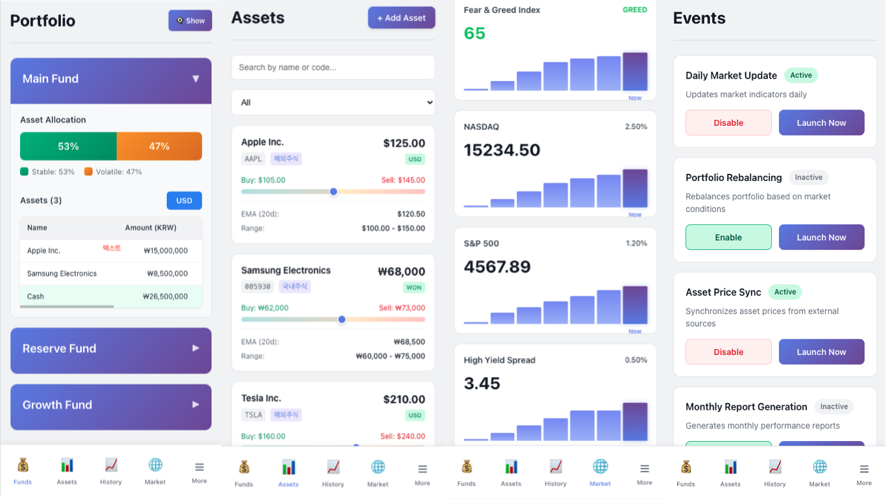

# Invest Indicator Web Application


## 개요

투자 현황과 시장 상태를 모니터링하는 Web Application입니다.

[Invest Indicator](https://github.com/ChoSanghyuk/invest_indicator)를 backend server로 가지고 있으며, Invest Indicator가 제공하는 정보들을 받아 시각화하고, 유저가 서버와 상호작용할 수 있도록 하는 middleware의 역할을 수행합니다.


### 주요 기능

- 투자 상태 : 자산 그룹을 용도에 맞게 분리, 생성하여 자산 그룹에 따라 투자 현황을 관리
- 관심 종목 정보 : 등록한 종목의 가격 및 매수/매도 가격 알림을 관리
- 투자 이력 : 자산 그룹별 투자 이력 조회
- 시장 지표 : 공포/탐욕 지수, 시장 index, High Yield Spread 등 참고할 시장 지표를 관리
- 투자 기록 : 투자한 이력을 기록. (현재는 증권사/코인 거래소 API를 통해 자동 기록)
- 이벤트 : 금/코인 김치 프리미엄, 거래소 Airdrop 알림, Avalanche Swap Tx 등의 작업 on/off 관리


### 주요 화면 샘플

:bulb: mock 모드로 실행되었을 때의 화면입니다.




## 실행

### 환경 설정

- 프로젝트 root에 `.env` 파일을 생성하여 변수 값을 생성합니다.
  - `VITE_USE_MOCK` : true 시 mock모드로 실행. false 시, 실제 backend 서버와 연결
  - `VITE_API_BASE_URL` : backend 서버의 url
- `.env.example` 파일을 참조하여 `.env` 파일을 생성합니다.


### 실행

- dev 모드 : `npm run dev`

- 빌드 : `npm run build`

  

## Project Structure

```
invest_indicator_app/
├── src/                    # 메인 애플리케이션 소스 코드
│   ├── pages/              # 페이지 컴포넌트 (Login, Home, Assets, Market 등)
│   ├── components/         # 재사용 가능한 UI 컴포넌트 (Navigation, Modal 등)
│   ├── services/           # API 통신 및 비즈니스 로직 (auth, asset, fund, market 등)
│   ├── context/            # React Context를 통한 전역 상태 관리 (AuthContext)
│   ├── hooks/              # 커스텀 React Hooks (useAuth 등)
│   ├── config/             # 설정 파일 (API 설정, Mock/Real 모드 토글)
│   ├── types/              # 데이터 타입 및 모델 정의
│   ├── utils/              # 공통 유틸리티 함수
│   └── assets/             # 정적 리소스 (이미지, 아이콘 등)
├── spec/                   # API 및 기능 명세서
├── public/                 # 정적 파일 (Vite에서 직접 서빙)
├── dist/                   # 빌드 결과물 (프로덕션 배포용)
├── assets/                 # 프로젝트 문서용 이미지
├── .env.example            # 환경 변수 템플릿
└── vite.config.js          # Vite 빌드 설정

```

### 주요 디렉토리 설명

- **src/pages/**: 각 페이지별 컴포넌트 (LoginPage, HomePage, AssetsPage, MarketPage, InvestPage 등)
- **src/services/**: Backend API와의 통신을 담당하는 서비스 레이어. Mock/Real API 모드 지원
- **src/context/**: React Context API를 활용한 전역 상태 관리 (인증 상태 등)
- **spec/**: Backend API의 계약 사양을 정의한 명세서. AI Agent에게 구현할 기능의 명세 제공
- **spec/common/**: 모든 API에 공통으로 적용되는 타입, 인증, 에러 처리 명세


